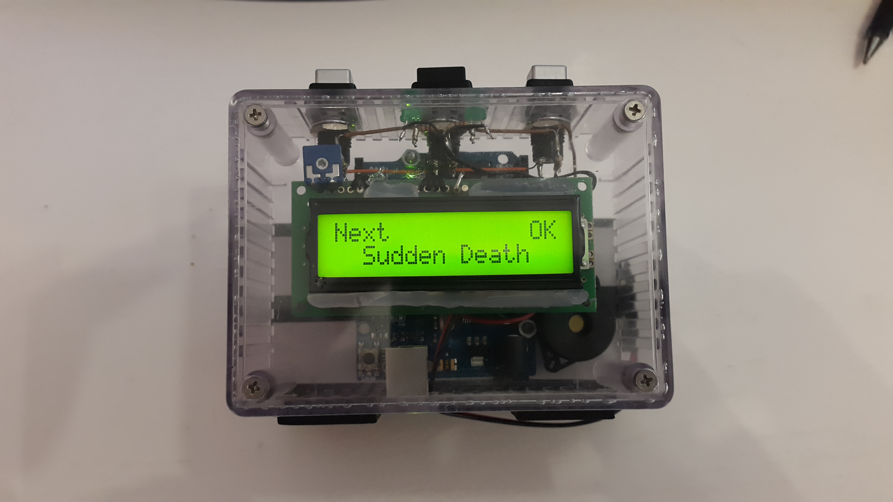

# Arduino Go Game Clock

A [Go](https://en.wikipedia.org/wiki/Go_(game)) game clock. It has pre-defined time controls inspired in gaming sites such as KGS, IGS Panda, ChessCube and the South African Go Association.

Cloned from [Matias G. Rodriguez's original project](https://github.com/matiasgrodriguez/Arduino). I've added two LEDs, and changed the pinout, and removed his other projects.
